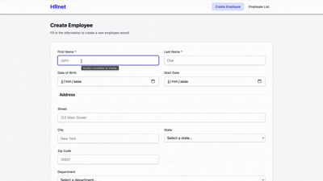

# 📘 HRnet — React Conversion

**WealthHealth | HRnet** est l’application interne de gestion des employés d’une grande société financière.  
Cette version est une **refonte complète en React** de l’application jQuery d’origine.  
L’objectif est de **réduire la dette technique**, **améliorer les performances**, et **moderniser l’interface** tout en conservant les mêmes fonctionnalités.

---

## 🚀 Objectif du projet

Ce projet est réalisé dans le cadre du **Projet 14 — OpenClassrooms : “Faites passer une librairie jQuery vers React”**.

### 🎯 Missions :

- Convertir l’application HRnet de **jQuery vers React**
- Créer les pages **“Create Employee”** et **“Employee List”**
- Convertir l'un des **quatre plugins** jQuery actuels en React (DateTimePicker, SelectMenu, DataTables, Modal).
- Remplacer les **3 plugins** jQuery restants par des composants React ou importer depuis des libraires existantes.
- Effectuer une **analyse de performance avant/après** avec Lighthouse
- Documenter le composant React converti

---

## 🧱 Stack technique

| Technologie                | Rôle                              |
| -------------------------- | --------------------------------- |
| **React 18**               | Base de l’application             |
| **Vite**                   | Build moderne et rapide           |
| **Redux Toolkit**          | Gestion d’état globale            |
| **React Router DOM**       | Navigation entre les pages        |
| **Tailwind CSS v4**        | Stylisation moderne et responsive |
| **PostCSS / Autoprefixer** | Préprocesseurs CSS                |
| **Lighthouse**             | Analyse des performances          |

---

## 📂 Structure du projet

```
src/
├── app/
│   ├── store.js              # Configuration Redux
│   └── routes.jsx            # Routing principal
├── components/
│   └── Navbar.jsx            # Barre de navigation
├── data/
│   └── usStates.js           # Données des États US
├── features/
│   └── employees/
│       ├── employeeSlice.js  # Reducer + actions Redux
│       ├── CreateEmployee.jsx # Page de création d'employé
│       └── EmployeeList.jsx   # Page de liste des employés
├── style/
│   └── index.css             # Styles globaux avec Tailwind
├── assets/                   # Images et ressources statiques
├── App.jsx                   # Composant racine de l'application
├── main.jsx                  # Point d'entrée de l'application
└── index.css                 # Styles de base
```

---

## ⚙️ Installation

### 1️⃣ Cloner le dépôt

```bash
git clone https://github.com/thealamenthed/p14.git
cd p14/hrnet-react
```

### 2️⃣ Installer les dépendances

```bash
npm install
```

### 3️⃣ Lancer le serveur de développement

```bash
npm run dev
```

➡️ Ouvrir [http://localhost:5173](http://localhost:5173)

### 4️⃣ Créer le build de production

```bash
npm run build
npm run preview
```

---

## 🧩 Fonctionnalités

### ✅ Create Employee

- Formulaire complet (prénom, nom, dates, adresse, département)
- Enregistrement via Redux + persistance dans localStorage
- Redirection automatique vers la liste après enregistrement
- _(Étape suivante)_ Affichage d'une Modal React confirmant la création

### ✅ Employee List

- Liste des employés créée dynamiquement
- Données persistées localement
- Table responsive stylisée avec Tailwind
- _(Étape suivante)_ Ajout de tri/filtre avec TanStack Table

---

## 🧮 Gestion d'état (Redux)

L'application centralise ses données via Redux Toolkit :

```javascript
{
  employees: {
    items: [
      {
        id: "uuid",
        firstName: "John",
        lastName: "Doe",
        startDate: "2025-10-01",
        department: "Sales",
        street: "123 Main St",
        city: "Boston",
        state: "MA",
        zipCode: "02108"
      }
    ];
  }
}
```

Les données sont automatiquement sauvegardées dans `localStorage` pour persister après rechargement.

---

## 🧰 Scripts utiles

| Commande          | Description                            |
| ----------------- | -------------------------------------- |
| `npm run dev`     | Lance le serveur de développement      |
| `npm run build`   | Build de production                    |
| `npm run preview` | Lance un serveur local sur le build    |
| `npm run lint`    | Vérifie la qualité du code (optionnel) |

---

## 📊 Analyse de performance (Lighthouse)

Dans le cadre de la migration de l’application HRnet de jQuery vers React, des audits Lighthouse ont été réalisés avant et après refonte.

Les résultats complets sont disponibles dans le dossier :

```
audits/
  ├── lighthouse-old-create-employee.json
  ├── lighthouse-old-employee-list.json
  ├── lighthouse-new-create-employee.json
  └── lighthouse-new-employee-list.json
```

### 🧪 Méthodologie

- Mode : **Desktop (Lighthouse)**
- 5 fois par page
- Comparaison sur les pages :
  - `Create Employee`
  - `Employee List`
- Mesures réalisées sur la version jQuery puis sur la version React buildée (`npm run build`)

---

## 📈 Résultats synthétiques

### 🔹 Create Employee

| Indicateur  | Ancienne version (jQuery) | Nouvelle version (React) | Amélioration  |
| ----------- | ------------------------- | ------------------------ | ------------- |
| LCP         | ~0.67 s                   | ~0.45 s                  | ✔ Plus rapide |
| Speed Index | ~0.66 s                   | ~0.47 s                  | ✔ Plus fluide |

Fichiers associés :

- `lighthouse-old-create-employee.json`
- `lighthouse-new-create-employee.json`

---

### 🔹 Employee List

| Indicateur  | Ancienne version (jQuery) | Nouvelle version (React) | Amélioration  |
| ----------- | ------------------------- | ------------------------ | ------------- |
| LCP         | ~0.47 s                   | ~0.42 s                  | ✔ Plus rapide |
| Speed Index | ~0.47 s                   | ~0.41 s                  | ✔ Plus fluide |

Fichiers associés :

- `lighthouse-old-employee-list.json`
- `lighthouse-new-employee-list.json`

---

## 🟩 Conclusion

La migration vers React permet :

- Une réduction importante du JavaScript chargé
- Une amélioration du temps de chargement
- Une interface plus fluide
- Une suppression de toute la dette technique liée aux plugins jQuery

L’ensemble des rapports JSON peut être chargé dans Lighthouse pour vérifier les résultats en détail.

---

## 🎥 Aperçu de l’application



## 📜 Auteur

- 👤 **Développeuse** : Dalila Lé
- 🏫 **Formation** : OpenClassrooms — Développeur d'application - JavaScript React
- 📅 **Année** : 2025
